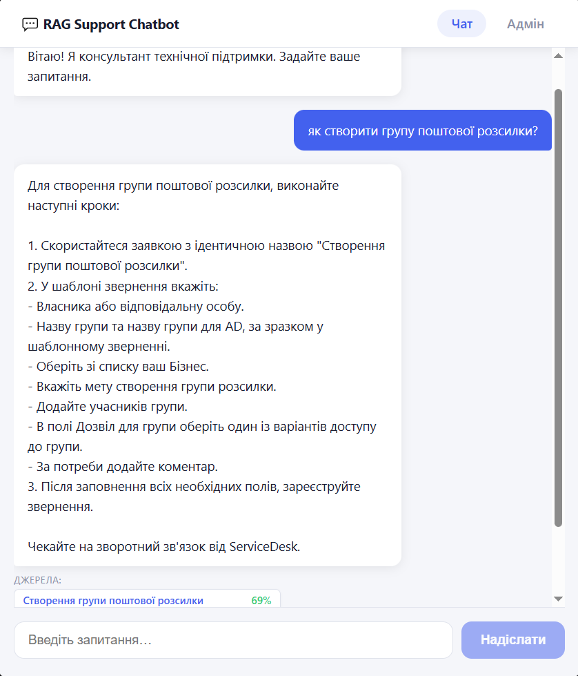
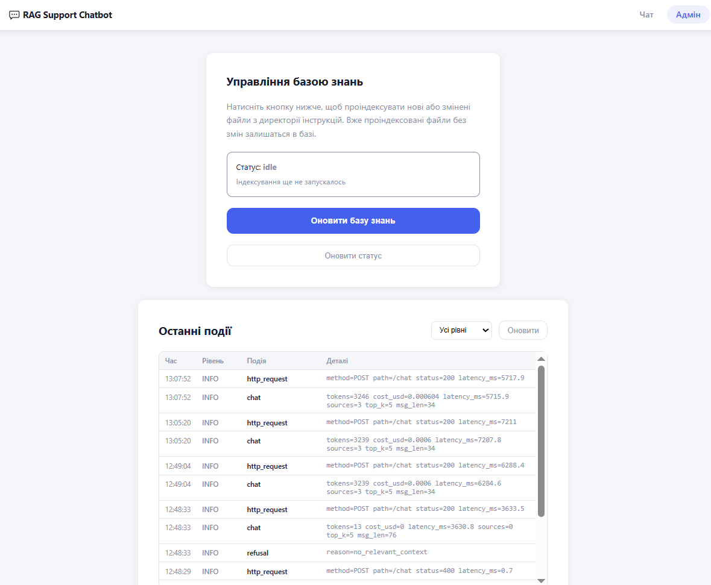

# RAG-чатбот технічної підтримки

Чатбот-консультант на основі Retrieval-Augmented Generation (RAG).  
База знань — набір HTML/ASPX-інструкцій із локальної папки.  
Бот відповідає тільки на основі цих інструкцій і показує джерела.

## Скріншоти

| Чат | Адмін-панель |
|:---:|:---:|
|  |  |

## Архітектура

```
HTML-папка → [Indexing pipeline] → ChromaDB
                                       ↑
React UI ⇄ FastAPI ⇄ retrieval ⇄ ─────┘
                   ⇄ LLM (OpenAI / OpenRouter)
```

| Шар | Технологія |
|---|---|
| Очищення HTML | trafilatura + BeautifulSoup |
| Чанкінг | LangChain `RecursiveCharacterTextSplitter` |
| Embeddings | OpenAI `text-embedding-3-small` |
| Векторна БД | ChromaDB (embedded, persist у файл) |
| LLM | OpenAI ↔ OpenRouter (перемикач через `.env`) |
| Бекенд | FastAPI |
| Фронтенд | React + Vite |

## Структура репозиторію

```
/
├── backend/
│   ├── app/
│   │   ├── config.py      # Pydantic Settings (читає .env)
│   │   ├── cleaner.py     # HTML/ASPX → чистий текст
│   │   ├── indexing.py    # chunking + embeddings + ChromaDB
│   │   ├── query.py       # retrieval + LLM
│   │   └── main.py        # FastAPI: /chat, /reindex, /status
│   ├── index.py           # CLI: індексування
│   ├── diagnose.py        # CLI: перевірка якості (Чекпоінти А та Б)
│   ├── run_eval.py        # CLI: регресійний eval (golden set)
│   ├── eval/              # golden.json, detectors, LLM-суддя, baseline
│   ├── data/
│   │   └── instructions/  # ← кладіть HTML-файли сюди
│   └── requirements.txt
├── frontend/              # React + Vite
├── .env.example
├── .gitignore
└── README.md
```

## Швидкий старт

### 1. Налаштування бекенду

```bash
cd backend
python -m venv .venv
# Windows:
.venv\Scripts\activate
# macOS/Linux:
source .venv/bin/activate

pip install -r requirements.txt
```

Скопіюйте `.env.example` → `backend/.env` і заповніть ключі:

```bash
cp ../.env.example .env
# відредагуйте .env: вставте OPENAI_API_KEY, за потреби інші змінні
```

### 2. Додайте HTML-файли

Помістіть файли інструкцій у `backend/data/instructions/`  
(підтримуються `.html`, `.htm`, `.aspx`).

### 3. Індексування

```bash
# з директорії backend/
python index.py           # інкрементальне оновлення
python index.py --force   # повна переіндексація
```

### 4. Діагностика якості (необов'язково)

```bash
python diagnose.py --all         # всі чекпоінти
python diagnose.py --clean       # Чекпоінт А: якість очищення
python diagnose.py --chunks      # Чекпоінт А: статистика чанків
python diagnose.py --retrieval   # Чекпоінт Б: якість пошуку
```

### 5. Запуск бекенду

```bash
# з директорії backend/
uvicorn app.main:app --reload
# API доступне на http://localhost:8000
```

### 6. Запуск фронтенду

```bash
cd frontend
npm install
npm run dev
# UI доступне на http://localhost:5173
```

## Регресійний eval (golden set)

Перевіряє, що при зміні моделі, промпту чи бази знань **якість і безпека не
просіли**. Запускається з CLI (не з адмінки — це інженерний quality-gate, до
того ж кожен прогін платний). Потрібен `OPENAI_API_KEY` у `backend/.env`.

```bash
# з директорії backend/
python run_eval.py                   # повний прогін, порівняння з baseline
python run_eval.py --runs 5          # більше прогонів для security/offtopic/pii
python run_eval.py --no-judge        # без LLM-судді (дешевше)
python run_eval.py --update-baseline # зафіксувати поточні метрики як еталон
```

Міряються leak rate (injection), PII, refusal rate (offtopic), retrieval
recall@k, покриття ключових фактів і faithfulness (LLM-суддя). `run_eval.py`
повертає **exit code ≠ 0**, якщо провалено gate або метрика просіла відносно
baseline — тож його можна вставити кроком у CI.

Звіт: `backend/eval/results/REPORT.md`. Деталі та опис кейсів — у
[`backend/eval/README.md`](backend/eval/README.md).

> Перевірка нової моделі: змінити `LLM_MODEL` у `.env` → `python run_eval.py`.
> Нові документи: `python index.py --force`, додати кейси в `golden.json`, прогнати.

## API

| Метод | Ендпоінт | Опис |
|---|---|---|
| `POST` | `/chat` | `{message, top_k?}` → `{answer, sources}` |
| `POST` | `/reindex` | Запуск індексування у фоні |
| `GET` | `/status` | Статус індексування |

## Конфігурація

Всі параметри задаються через `backend/.env`:

```env
EMBEDDING_PROVIDER=openai       # openai (не змінювати після індексації!)
OPENAI_API_KEY=sk-...

LLM_PROVIDER=openai             # openai | openrouter
OPENROUTER_API_KEY=             # тільки для openrouter
LLM_MODEL=gpt-4o-mini

HTML_DIR=./data/instructions
CHROMA_DIR=./data/chroma
```

> **Увага:** `EMBEDDING_PROVIDER` прив'язаний до бази. Якщо змінити його після індексації — потрібна повна переіндексація (`python index.py --force`).
